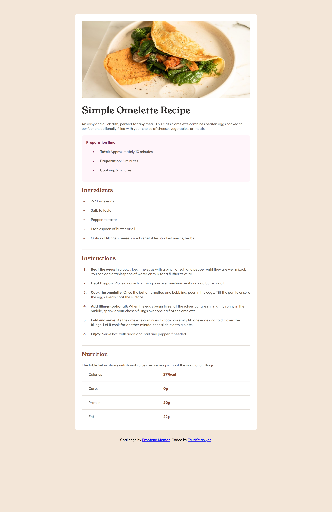
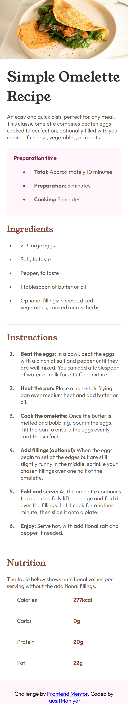

# Frontend Mentor - Recipe page solution

This is a solution to the [Recipe page challenge on Frontend Mentor](https://www.frontendmentor.io/challenges/recipe-page-KiTsR8QQKm). Frontend Mentor challenges help you improve your coding skills by building realistic projects. 

## Table of contents

- [Overview](#overview)
  - [The challenge](#the-challenge)
  - [Screenshot](#screenshot)
  - [Links](#links)
  - [Built with](#built-with)
  - [What I learned](#what-i-learned)
  - [Continued development](#continued-development)
- [Author](#author)
- [Acknowledgments](#acknowledgments)

## Overview
  Hello Guys! This is my second Fronted Mentor Challenge, i try to recreate Recipe Page, i try to make it as accurate as i can, constructive criticism are always welcome.

### Screenshot





### Links

- Solution URL: [Add solution URL here](https://your-solution-url.com)
- Live Site URL: [Add live site URL here](https://your-live-site-url.com)

### Built with

- Semantic HTML5 markup
- CSS custom properties
- CSS Grid
- Desktop-first workflow

### What I learned

I learn about Psuedo-Element(::marker), Psuedo-Classes (:first-child, :last-child and :root) and Variables(var(--Dark-Raspberry)).

```html
    <table>
        <tr>
          <td class="pd">Calories</td>
          <td class="co">277kcal</td>
        </tr>
        <tr>
          <td class="pd">Carbs</td>
          <td class="co">0g</td>
        </tr>
        <tr>
          <td class="pd">Protein</td>
          <td class="co">20g</td>
        </tr>
        <tr>
          <td class="pd">Fat</td>
          <td class="co">22g</td>
        </tr>
    </table>
```
```css
:root {
    --Nutmeg: hsl(14, 45%, 36%);
    --Dark-Raspberry: hsl(332, 51%, 32%);
    --White: hsl(0, 0%, 100%);
    --Rose-White: hsl(330, 100%, 98%);
    --Eggshell: hsl(30, 54%, 90%);
    --Light-Grey: hsl(30, 18%, 87%);
    --Wenge-Brown: hsl(30, 10%, 34%);
    --Dark-Charcoal: hsl(24, 5%, 18%);
  }

#pinkco::marker {
    color: var(--Dark-Raspberry);
  }

li::marker {
    color: var(--Nutmeg);
    font-weight: bold;
  }

p:first-child {
    padding-bottom: 20px;
    color: var(--Dark-Raspberry);
    font-weight: bolder;
  }

tr:last-child {
    border-bottom: none;
  }
```

### Continued development

Continuing forward i want to focus more on css, i think i use css for something i don't really need to because i don't know more css properties or how to actually use it and more about Psuedo-Elements and Psuedo-Classes. Oh also I suck at naming things.

Criticism are always Welcome.

## Author

- Frontend Mentor - [@TausifManiyar](https://www.frontendmentor.io/profile/TausifManiyar)
- Github - [@TausifManiyar](https://github.com/TausifManiyar)

## Acknowledgments

Shoutout to all Web Developer Youtubers.